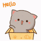
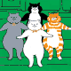
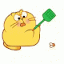
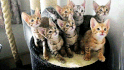

# 🐾 **The Cat Coders** 🐾

## **Welcome to Our Project!** 

Welcome to **The Cat Coders'** official repository! We're a group of passionate
learners collaborating on exciting Python programming challenges, dedicated to sharpening
our Python skills through collaboration and creativity.

---

##  **About Us**

We are **The Cat Coders**, a team of enthusiastic programmers driven by curiosity,
creativity, and a love for clean, efficient code. Our goal is to learn, grow,
and build projects that make a difference.

### **Our Mission:**

- Focus on solving programming challenges, debugging code, and enhancing our
Python skills through collaborative problem-solving.
- Learn collaboratively and share knowledge.
- Review each other's code and getting familiar with Github.
- Foster an inclusive and supportive team environment.

---

## 🗂️ **Repository Files**

| File/Directory                                           | Description     |
| -------------------------------------------------------- | -----------------|
| [📂 .github/](.github/)                                   | GitHub workflows and actions.                   |
| [📂 .vscode/](.vscode/)                                   | VS Code configuration files.                    |
| [📂 assets/](assets/)                                     | Fun images and GIFs for the README.             |
| [📂 collaboration/](collaboration/)                       | Contains our team's collaboration files. |
| ├── [📂 guide/](collaboration/guide/)                     | Guidance documents for completing this project effectively. |
| ├── [communication.md](collaboration/communication.md)   | Communication plan for the team.                |
| ├── [constraints.md](collaboration/constraints.md)       | Constraints and rules for the project.          |
| ├── [learning_goals.md](collaboration/learning_goals.md) | Shared learning objectives for the team.        |
| ├── [README.md](collaboration/README.md)                 | Overview of the collaboration folder.           |
| ├── [retrospective.md](collaboration/retrospective.md)   | Retrospective summaries of project phases.      |
| [📂 solutions/](solutions/)                               | Python solutions for programming challenges.    |
| ├── [tests/](solutions/tests/)                           | Unit tests for the Python solutions.            |

---

##  **Communication**

- **Slack:** For **Daily** updates on our progress.
- **Weekly Meetings:** Every **Tuesday at 7 PM Egypt Time** on **Zoom**.

---

##  **Team Values**

- **Open Communication:** Share ideas and ask questions freely.
- **Respect:** Every voice matters.
- **Accountability:** Own your tasks and support your teammates.
- **Collaboration:** Work together, learn together, grow together.

---

## ⭐ **Acknowledgments**

Shoutout to every member of **The Cat Coders** for their dedication and hard work.
Let's keep coding and keep growing—one paw at a time! 🐾✨

---

**Stay curious, stay creative, and keep coding! 🐈‍⬛💻**

