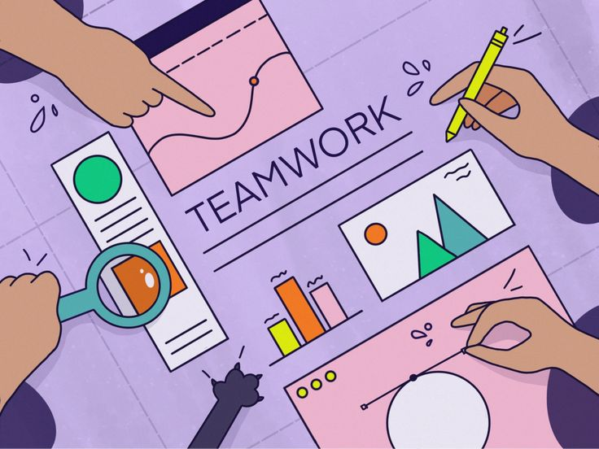

# MIT Avatars



Welcome to the **MIT Avatars** repository! This is where our group collaborates,
learns, and grows together by solving Python challenges, sharing knowledge, and
developing innovative coding solutions.

---

## 👥 Meet the Team

We’re a group of passionate and diverse learners united by a love for coding and
problem-solving. Here's a brief introduction to our team members:

- **Aseel 🎯**  
  *Fun Fact:* "I love playing Sudoku—it’s like a workout for my brain!"

- **Ameen 🏉**  
  *Fun Fact:* "I am a professional rugby player. I play professional rugby nationally
  in Lebanon and represent Palestine internationally."

- **Maria ✈️**  
  *Fun Fact:* "I love traveling as much as I love food – the only difference
   is, one fills my passport and the other fills my stomach!"

- **Muhannad 🧑🏻‍💻**  
  *Fun Fact:* "When I feel lost in the maze of learning, I just hit the 'code' button
  because nothing finds the way like programming!"

- **Maher 🛣️**  
  *Fun Fact:* "I really like playing rugby."

- **Malak ❇️**  
  *Fun Fact:* "I look for purpose in almost everything I do."

- **Abdulrahman 🕊**  
  *Fun Fact:* "I'm a medical student who codes and leads teams—blending science,
   tech, and leadership in a unique way! I also love cats."

---

## 📌 Purpose of this Repository

This repository is our collaborative space for:

- 📝 **Sharing Python challenges:** Post interesting problems and work together
  on solutions.
- 💡 **Collaborating on innovative solutions:** Share diverse approaches and
  refine them.
- 📚 **Documenting our learning journey:** Note lessons learned and best practices.

---

## 🚀 Getting Started

Here’s how to get involved and contribute:

### 1️⃣ Fork the Repository

Click the **Fork** button at the top-right of this page to create your copy of
the repository.

### 2️⃣ Create an Issue

Navigate to the **Issues** tab and submit an issue describing the challenge.

### 3️⃣ Work on the Challenge

Clone the repository to your local machine using:

```bash
git clone https://github.com/YOUR-USERNAME/ET6-foundations-group-17.git
```

Create a new branch for your work:

```bash
git checkout -b feature/your-feature-name
```

### 4️⃣ Submit Your Work

Push your changes to the branch:

```bash
git add .
git commit -m "Description of changes"
git push origin feature/your-feature-name
```

Finally, open a pull request and wait for feedback from your team.

---

## 🌟 Code of Conduct

To foster a welcoming and collaborative environment:

- Be respectful and constructive in your feedback.
- Share knowledge and support each other.
- Embrace diversity in ideas and approaches.

---

## 🛠️ Tech Stack

This repository uses:

- **Python:** Our primary programming language for solving challenges.
- **Git/GitHub:** For version control and collaboration.

---

## 🎯 Goals

As the MIT Avatars, we aim to:

- Strengthen our problem-solving skills.
- Enhance our Python proficiency.
- Build a supportive and creative learning community.
- Make it to the MIT program as a team.

🔗 **Group Repository:**  
Check out our repository:  
[MIT-Emerging-Talent/ET6-foundations-group-17](https://github.com/MIT-Emerging-Talent/ET6-foundations-group-17)
