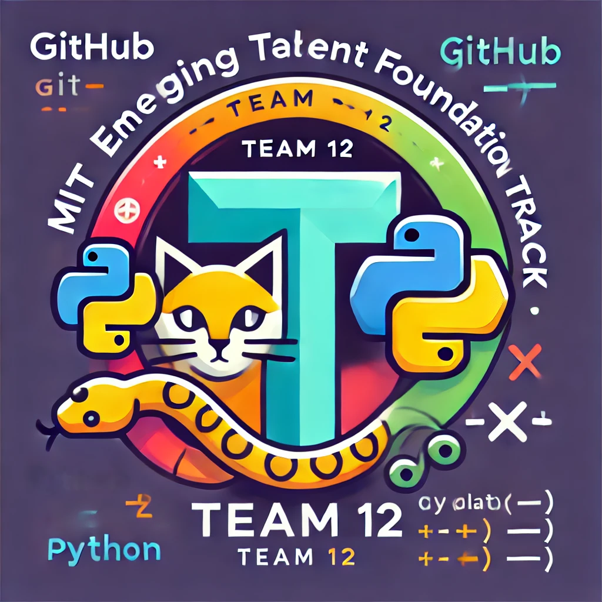

# MIT Emergent Talent Foundation Track Assignment - Group 12

Welcome to the repository for **Group 12**'s assignment as part of the MIT Emerging
Talent Foundation
Track. This repository represents our collaborative effort to explore, learn, and
apply essential skills in software development through the implementation of a
**calculator project**. Each member of the team is contributing unique functionalities
to the calculator, reviewing each other’s code, and refining the project as a group.

## Project Overview

This repository serves as the final deliverable for the Foundation Track, showcasing
our teamwork and dedication to mastering foundational concepts in software development.
Our primary objective is to collaboratively design and develop a calculator, with
every team member contributing to its various functionalities.

As a team of **10 emerging talents**, we are working together to:

- Implement different features of the **calculator project**, including basic arithmetic,
advanced functions, and more.
- Collaborate on code reviews to ensure high quality and maintainability.
- Utilize **Git** for version control and collaboration.
- Navigate and manage projects effectively on **GitHub** using issues, pull requests,
and project boards.
- Adhere to **test-driven development (TDD)** cycles to ensure robust and reliable
code.

## Tools and Technologies

- **Programming Language**: Python
- **Version Control**: Git, integrated with GitHub
- **Editor**: Visual Studio Code (VS Code) with extensions to enhance productivity
- **Collaboration**: GitHub issues, pull requests, and project boards

## About Group 12

We are a motivated and enthusiastic group of learners, collaborating as contributors
to this shared repository. This assignment is more than an assessment requirement
for us—it is an opportunity to build skills, share knowledge, and grow together as
a team. Through the development of this calculator project, we aim to foster a culture
of learning and innovation, focusing on:

- **Teamwork**: Working together to design, implement, and refine the calculator’s
features.
- **Communication**: Ensuring clear and constructive collaboration during reviews
and discussions.
- **Continuous Learning**: Building technical and soft skills through hands-on experience
and feedback.

## Project Structure

The calculator project is structured to ensure modularity and ease of collaboration.
Key elements include:

- **Feature Modules**: Each team member is responsible for implementing specific
features, such as addition, subtraction, or other advanced scientific functions.
- **Testing**: A dedicated test suite ensures all functionalities work as intended,
following TDD principles.
- **Documentation**: Comprehensive documentation accompanies the code to ensure
clarity and usability.

---

We invite you to explore this repository and witness our journey of growth, teamwork,
and learning through the development of this calculator project.

Thank you for visiting our repository!
