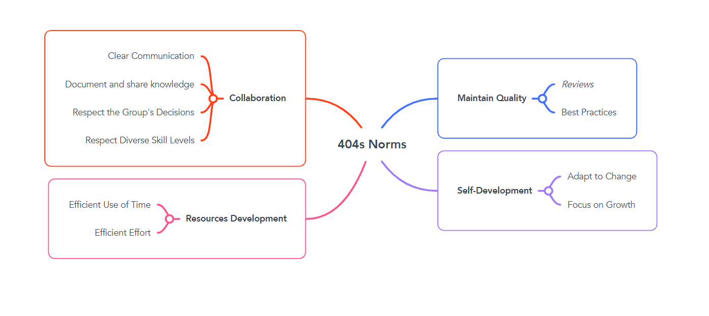

# Collaboration

## 404s Norms Summary

> In **404s**, we focus on effective teamwork, continuous self-development,
> efficient resource use, and maintaining high-quality standards. We achieve
> this by making clear communication, mutual respect, and adaptability.
> Our goal is to **Grow** through **Collaboration**.\
> In **404s**, Together, we code. Together, we grow.

<!-- group norms summary -->

<!-- group norms list -->
## 404s Norms list

### Team work

#### Clear Communication

> **Share updates and challenges with the group.**\
> **Use easy tools for async communication.**\
> **Be mindful of everyone's working hours in our international team.**

#### Collaborate, Don’t Compete

> **Offer help when needed, share resources, and brainstorm together.**\
> **Celebrate success by acknowledging everyone’s contributions.**

#### Respect Diverse Skill Levels

> **Try to help explain concepts for other team members.**\
> **Offer constructive feedback when reviewing solutions.**

#### Respect the Group's Decisions

> **Ensure that decisions are made collectively and that everyone's voice is heard.**\
> **Stick to agreed-upon strategies, tools, and workflows to ensure consistency.**

#### Document and Share Knowledge

> **Keep Notes in a shared place**
---

### Self-Development

#### Focus on Growth

> **Encourage Exploration new techniques that help improve your skills**\
> **Learn From Mistakes**

#### Adapt to Change

> **Be Flexible in new challenges, changes in direction, or adjusting deadlines**\
> **Adapt to Team Dynamics and be open for new changes in tools or strategies**
---

### Resource Development

#### Efficient Use of Time

> **Time Management with agreed-on tools to keep things organized and planned ahead**\
> **Avoid Procrastination by sticking to deadlines as possible as we can**

#### Efficient Effort

> **Work smart, not hard.**

---

### Quality Assurance

#### Maintain Code Quality

> **Review others’ code for quality and clarity and offer suggestions for improvement**\
> **Use Best Practices by following standard coding conventions**

---

### 404s Norms Mind Map

