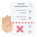
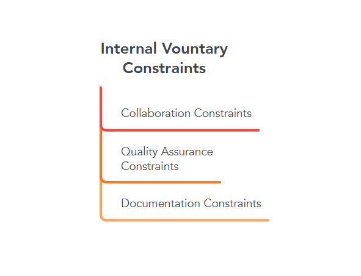

#   Constraints

> In this readme, we explain potential **constraints** that limit our
> productivity and achievement throughout the project trip.

##  Constraints

> For each team member, we will explain the constraints.

### _Salem 👀_

| Constraint |Type | Description |
|:------:|:-------:|:-------:|
| Power & internet 🛜 |External| I have limited hours when power is available|
| Deadlines ❌ |External|I have college deadlines in addition to MET program deadlines|

### Nagham

| Constraint |Type | Description |
|:------:|:-------:|:-------:|

### Nilson

| Constraint |Type | Description |
|:------:|:-------:|:-------:|

#### Summary

> Summary of External constraints.

##  Internal: Involuntary

### Examples
<!--
  constraints that come from within your team, and you have no control over:
  - each of your individual skill levels
  - amount of time available to work on the project
-->
### 1. Various Skill Levels🎚️

- Limited experience with specific tools, methodologies, or frameworks.
- Uneven distribution of skills across team members.
  
### 2. Communication Challenges💬

- Communication hardship due to limited resources of power and internet.

### 3. Productivity unstability🦥

- Due to unstable circumstances ongoing on team members' locations.

##   Internal: Voluntary

