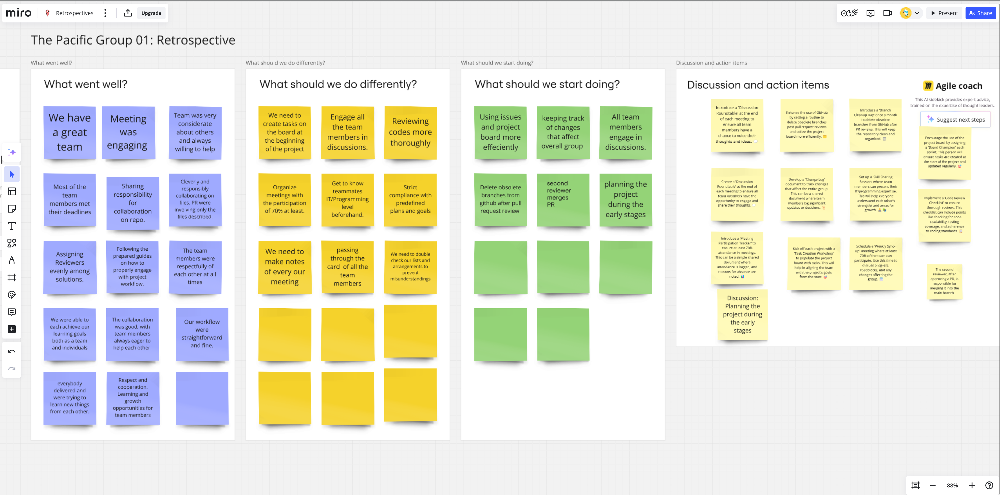

# Retrospective

## Stop Doing

- Not creating tasks on the board at the beginning of the project.
- Reviewing code insufficiently or skipping thorough reviews.
- Failing to engage all team members in discussions.
- Neglecting to make notes of every meeting.
- Overlooking compliance with predefined plans and goals.
- Allowing outdated branches to remain after pull requests.

## Continue Doing

- Sharing responsibilities and collaborating effectively on the repository.
- Respectfully communicating and engaging all team members.
- Following prepared guides for workflows and assigning reviewers evenly.
- Ensuring meetings remain engaging and productive.
- Delivering quality results while fostering a learning and growth environment.

## Start Doing

- Using the issues and project board more efficiently to track progress.
- Keeping track of changes that affect the overall group.
- Planning the project during the early stages for better alignment.
- Deleting obsolete branches immediately after pull request reviews.
- Ensuring the second reviewer merges the pull request after approval.

## Lessons Learned

- Effective collaboration and respect among team members significantly improve
project outcomes.
- A lack of structured planning and incomplete documentation can lead to inefficiencies.
- Including all team members in discussions ensures diverse perspectives and avoids
misunderstandings.
- Early and clear communication about roles, goals, and expectations sets the
stage for a smoother workflow.

---

## Strategy vs. Board

### What parts of your plan went as expected?

- The team worked collaboratively, sharing responsibilities on the repository.
- Meeting deadlines and engaging in productive discussions was a success.
- Prepared guides and structured workflows ensured smoother operations.

### What parts of your plan did not work out?

- Some team members were not fully involved in discussions or decision-making.
- Thorough code reviews and compliance with predefined goals were occasionally overlooked.
- Notes were not consistently taken during meetings, causing gaps in understanding.

### Did you need to add things that weren't in your strategy?

- Additional steps were required to ensure obsolete branches were deleted and compliance
with guidelines was reinforced.
- Assigning a second reviewer for pull request merges became necessary to maintain
quality.

### Or remove extra steps?

- Some redundant steps in workflow discussions were streamlined to save time.

---

