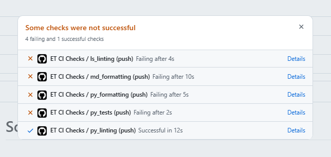

# **Meeting 03**

**20/12/27  
9.00 EST - 10 EST  
Google Meet  
Attendees: 7**

## **Agenda:** ET CI CHECKS

### **Topics Discussed:**

>FIXING CI CHECKS

### Key discussions

_How to fix the linting errors?_  
• **AN INIT PY FILE WILL BE ADDED TO MAIN**  
An init py file  (**init**.py) was added in main branch of _solutions_ file,
also in _test_ file.

### Decision made  

**Action Items**  
  _What needs to be done?_  
[ ] Ruff and Linting tests before merging.  

### Follow up

Merge files into the main branch and observe if any errors occur.  
Some files will be added on the main branch so when merging it will be checked.

### Other notes

We fixed the linting errors.

### Next meeting

Will be discussed on Slack  
12 EST “appropriate for everyone”  
On Ghyath terms :))
