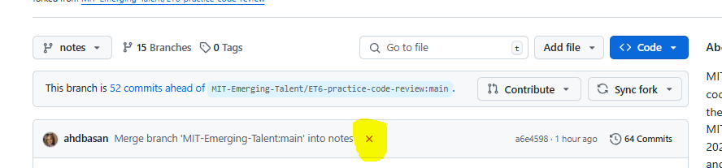
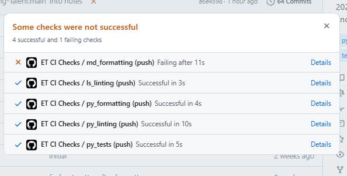

# **Meeting 04**

**31/12/24  
12.00 EST - 1.00 EST  
Google Meet  
Attendees: 6**

## **Agenda:**  ET CI Checks, Project Board and Issues

### **Topics Discussed:**

+ **Formatting**  
  > Always name files with snake_case  
  > Lint files before push to github (py-lint,
   ruff, markdown)
+ **Ruff formatting**  
  After finishing documenting and testing on VSCode  
  _Steps for ruff formatting (on terminal):_  
  > $ pip install ruff  
  > $ ruff check path/to/file  
  > $ ruff format path/to/file  

happy merging :)

+ **Before making a pull request make sure to pass
  all the ET CI Checks**  
_Details will appear like this:_  

1. open the **x** (in yellow) in your branch pushed

1. Check which failed  

1. Details: Read why failed and fix
  
### Key discussions

<!--markdownlint-disable MD034 MD013-->
[**Project Board**](https://github.com/orgs/MIT-Emerging-Talent/projects/127/views/1)

+ Only issues will be on project board , the
pull request will be archived. The pull request
 will just be linked
  to the **_Issue_** in the **⚙️ Development**
  also add label tag.
+ When reviewing someone's code, make sure:  
  On the project Board: **_Issue_** : Assign
  yourself for review in
  **⚙️ Assignees**  
  On the pull request: Assign yourself for
  review in **⚙️ Reviewers**

### Decision made

**Group Implementation standards:**  

+ When Unit testing  
  _Preferred format for testing is (actual and expected)_:  

  ```text
   def test_0(self):
        """It should evaluate 0 to []"""
        actual = fibonacci_list(0) # call function with test arguments
        expected = [] # hand-write the expected return value
        self.assertEqual(actual, expected)

+ Module Docstring:

  ```text
   Module for --
   This module provides--
  Created: XX/X/XXXX
  Team Number: 28
  Team Name: MIT Alpha
  Author:---- 
  ```
  
### Follow up

+ Branches can be deleted if not used anymore
+ Write your code on the Doing on the Project
board and assign yourself
+ Any problem you faced (don't forget to make
a label)

### Other notes

**Deadline: 5th Jan**  
Two completed codes and reviewed and reviewed
two completed codes and merged.

### Next meeting

+ Check Slack.  
12 EST “appropriate for everyone”  
Maybe Friday or Saturday
